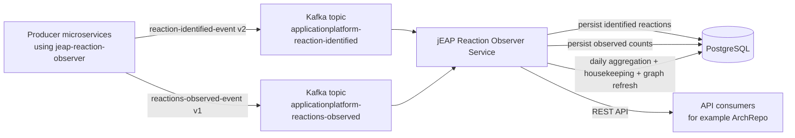

# Architecture

jEAP Reaction Observer Service is the consumer and aggregator for the events emitted by the sibling
[jEAP Reaction Observer library](https://jeap-admin-ch.github.io/docs/building-blocks/libraries/jeap-reaction-observer/getting-started).
It stores two kinds of information:

- identified reactions: the structural trigger/action pattern of a reaction
- observed reactions: counted occurrences of those reactions within a timeframe

The persisted data is aggregated into a graph-oriented read model served over HTTP.

## Runtime flow

## Modules

| Module | Responsibility |
|---|---|
| `jeap-reaction-observer-domain` | Domain model, repository interfaces, graph filtering, graph building, aggregation service |
| `jeap-reaction-observer-kafka` | Kafka listeners that transform incoming Avro events into domain objects |
| `jeap-reaction-observer-persistence` | JPA entities, JDBC/JPA repository implementations, Flyway migrations |
| `jeap-reaction-observer-web` | Spring Boot application, HTTP API, in-memory graph cache, scheduling, security, OpenAPI |
| `jeap-reaction-observer-service-test` | Shared event builders and test model objects for integration tests and consumers |
| `jeap-reaction-observer-service-instance` | POM-only packaging module for downstream service instances |

## Write path

### Reaction definitions

`ReactionIdentifiedEventListener` consumes `reaction-identified-event` messages and stores a `Reaction` containing:

- producer system name, normalized to lower case
- producer component/service name
- reaction id
- optional trigger observation
- zero or more action observations
- identification timestamp

The incoming event payload can contain a full reaction, trigger-only payload, or action-only payload; all three forms are handled.

### Observed counts

`ReactionsObservedEventListener` consumes `reactions-observed-event` messages and stores `ObservedReaction` records with:

- component name from the event publisher service
- reaction id
- timeframe start/end
- count

Persistence is idempotent per event idempotence id: `ObservedReactionRepositoryImpl` saves a batch only if no row with the
same idempotence id exists yet.

## Persistence model

Flyway creates four main tables over time:

- `reaction` for identified reactions
- `observation_property` for trigger/action properties
- `observed_reaction` for raw timeframe-based counts
- `observed_reactions_aggregated` for daily aggregated counts

Later migrations add ShedLock support, multi-action storage, the producer system name, an idempotence index, and an
interface table used to normalize trigger/action message definitions.

## Aggregation and graph building

`ScheduledTasksService` coordinates recurring jobs with ShedLock:

- aggregate yesterday's raw observations into `observed_reactions_aggregated`
- delete raw `observed_reaction` rows whose timeframe starts before today
- delete aggregated rows older than the configured statistics window
- rebuild the in-memory graph on a schedule and once at startup

`ReactionGraphRepositoryImpl` builds the full graph from persisted reactions:

- message/interface nodes come from normalized `InterfaceEntity` rows
- reaction nodes represent producer components within systems
- trigger edges connect message -&gt; reaction
- action edges connect reaction -&gt; message

`ReactionGraphBuilderService` then filters the graph to reactions observed since `fromDate` and enriches trigger edges with
median values computed from aggregated daily counts.

## Read path

`GraphHolder` stores the current graph in memory. `GraphController` serves:

- the full graph
- a graph filtered to one system
- a graph filtered to one component
- one subgraph per variant of a message type

Each response includes a fingerprint produced by `GraphFingerprintCalculator` from canonical JSON so consumers can detect changes.

The repository also exposes supporting lookup/statistics endpoints for known systems, known components, and the last
observation date per component. This API shape matches the service's role as an internal source for system-behaviour tooling.

## Related

- [Getting started](getting-started.md)
- [Configuration reference](configuration.md)
- [REST API](rest-api.md)
- Producer-side library docs: [jEAP Reaction Observer library](https://jeap-admin-ch.github.io/docs/building-blocks/libraries/jeap-reaction-observer/getting-started)
